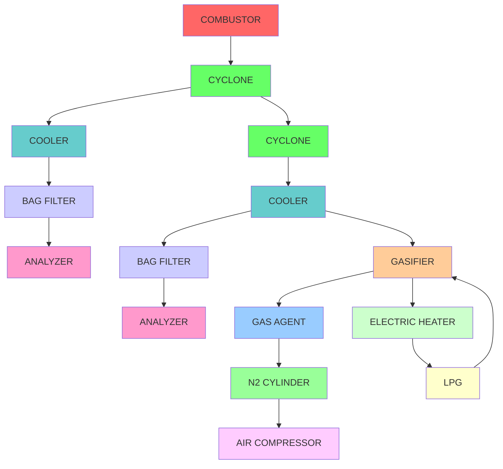

To convert the flow diagram into a Mermaid flowchart, I'll analyze the process from the given schematic and convert it step by step.

### Process flow analysis based on the diagram:

- **Combustor**: Primary source where combustion takes place.
- **Cyclone (Flue Gas and Gas)**: Separation of particles from the gas stream.
- **Cooler**: Cooling of gas.
- **Bag Filter**: Particle filtration from the gas stream.
- **Analyzer**: Analyzing the gas for specific components.
- **Gasifier**: Converts material into gas.
- **Gas Agent**: Introduces a gas agent (like N2).
- **Air Compressor**: Compresses air (likely for fluidization or another purpose).
- **Electric Heater**: Likely used to heat gas or other materials.
- **LPG**: Fuel supply, potentially used in the process.

Now, let's proceed with a Mermaid flowchart markdown representation.

This Mermaid chart outlines the key components and flow from your schematic diagram. Each node and connection corresponds to elements seen in the diagram. You can use this code in any Mermaid-enabled tool (like Mermaid Live Editor or in Markdown with proper Mermaid rendering support). Let me know if you need further adjustments!